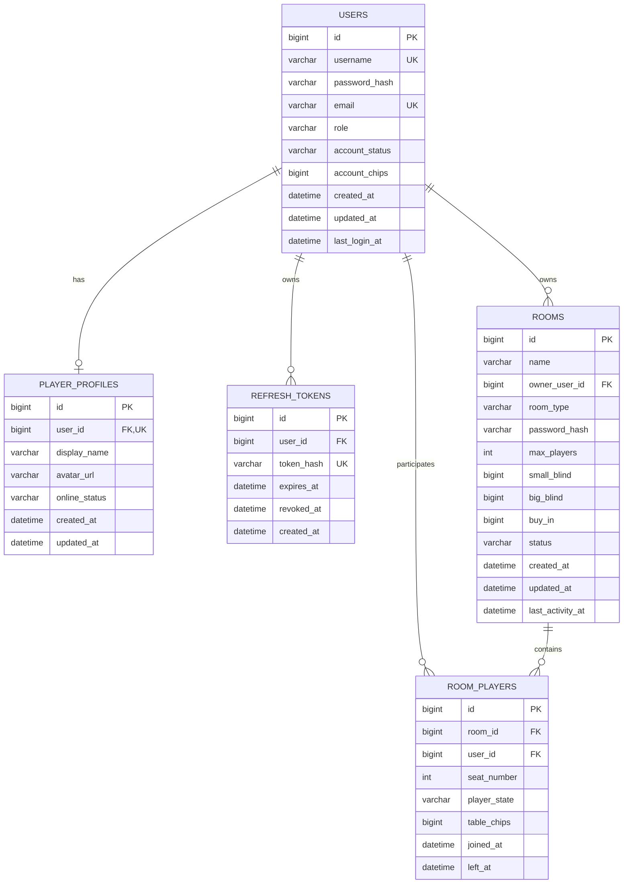
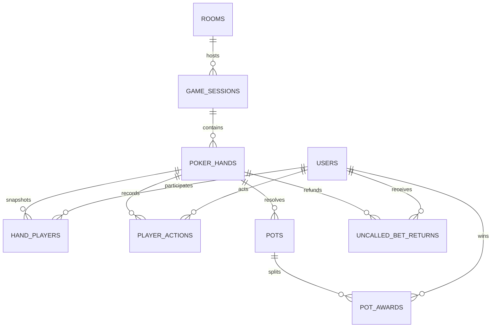

# Database Entity-Relationship Model

## Phase 2 implemented schema

The following tables are implemented by Flyway migrations `V1` through `V4`. All IDs and chip values use `BIGINT`; identifiers are database-generated. Tables use InnoDB, `utf8mb4`, and `utf8mb4_0900_ai_ci` for MySQL 8.x.

## Balance model

`users.account_chips` is the persistent Account Chip balance. `room_players.table_chips` is the Table Chip balance assigned inside one room. They are deliberately separate non-negative fields. Future buy-in/cash-out application services must transfer between them atomically and authoritatively; the Phase 2 schema does not implement gameplay or transfer logic. Because no initial economic grant is approved, the storage default for Account Chips is technically safe `0`.

## Implemented relationships and constraints

- `player_profiles.user_id` uniquely references `users.id`, producing zero or one profile per user.
- `refresh_tokens.user_id` references `users.id`; only token hashes are stored and are unique.
- `rooms.owner_user_id` references `users.id` with restricted deletion.
- `room_players.room_id` and `room_players.user_id` reference their owners.
- `(room_id, user_id)` prevents duplicate membership rows; `(room_id, seat_number)` prevents duplicate occupied seats while allowing multiple `NULL` spectator seats.
- User role is `PLAYER` or `ADMIN`; account status is `ACTIVE` or `LOCKED`.
- Presence is `ONLINE`, `IN_GAME`, or `OFFLINE`; persisted presence is only the last known projection, while realtime presence remains server/runtime-managed.
- Room type is `PUBLIC` or `PRIVATE`; public rooms cannot contain a password hash.
- Room state is `WAITING`, `PLAYING`, `FINISHED`, or `CLOSED`.
- Room-player state is `NOT_READY`, `READY`, `PLAYING`, `SPECTATING`, `DISCONNECTED`, or `LEAVING`.
- Account/Table Chips cannot be negative. Room capacity is 6–9, blinds and buy-in are positive, and the big blind exceeds the small blind.

## Phase 6A gameplay-history schema

Flyway `V5` adds the game-owned history model. A room can have many sessions and a session can have many numbered hands. Hands own immutable participant/action/pot settlement snapshots.

Board and private-card snapshots use deterministic comma-separated card codes such as `AS,KD,7H`. They are history storage, not public transport fields. Pot winners are normalized through `pot_awards`, allowing ties and per-winner payouts; unmatched excess is represented separately by `uncalled_bet_returns`.

## Planned after Phase 6A

The frozen logical model still plans `friendships`, `chat_messages`, `player_statistics`, `player_rankings`, `ranking_history`, `daily_statistics`, and `weekly_statistics`.

A Game Session now represents continuous play in one room and contains many individual Poker Hands. Phase 6A supplies persistence mappings only; runtime orchestration remains deferred.
